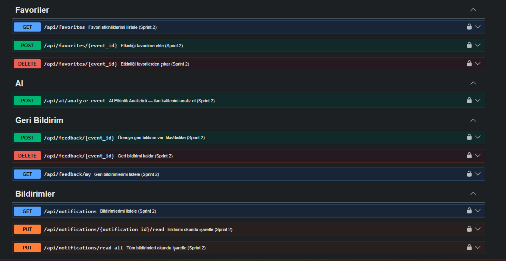

# **Takım İsmi**

Takım 122

# Ürün İle İlgili Bilgiler

## Takım Elemanları

- Şüheda Nur Gül: Product Owner / Scrum Master
- Serdar Kızılkale: Developer

## Ürün İsmi

🌉 **Briva** – Yapay Zekâ Destekli Gönüllülük Platformu

### İsim Kökeni

Briva ismi iki kavramdan türetilmiştir:

- **Bridge (Köprü)** → Gönüllüler ve STK'lar arasında bağlantı kurma  
- **Viva (Yaşam)** → İyiliğin ve sosyal etkinin hayatın içinde olması  

> İnsanları ve iyiliği birbirine bağlayan dijital köprü

## Ürün Açıklaması

Briva, gönüllüler ile sivil toplum kuruluşlarını tek bir platformda buluşturan yapay zekâ destekli bir gönüllülük sistemidir. Amaç, gönüllülüğü daha erişilebilir hale getirerek **doğru insanı doğru sosyal etki fırsatıyla buluşturmaktır.**

Bu proje **YZTA 2026 Yapay Zekâ ve Teknoloji Atölyesi Bootcamp Hackathon'u** için geliştirilmiştir.

### 🎯 Problem

Gönüllülük süreçleri şu anda parçalı ve verimsiz şekilde ilerlemektedir:

| Problem | Açıklama |
|--------|----------|
| Dağınıklık | Etkinlikler farklı kanallarda (sosyal medya vb.) |
| Eşleşme Sorunu | Gönüllüler uygun etkinliği bulamıyor |
| STK Erişim Sorunu | STK'lar doğru gönüllülere ulaşamıyor |
| Kişiselleştirme Eksikliği | Kullanıcıya özel öneri sistemi yok |

### 💡 Çözüm

Briva, tüm gönüllülük süreçlerini tek platformda toplar ve kullanıcıya özel öneriler sunar.

| Bileşen | Görev |
|--------|------|
| Gönüllü Profili | İlgi alanları, beceriler, uygunluk |
| STK Paneli | Etkinlik oluşturma ve başvuru yönetimi |
| AI Katmanı | Kural tabanlı eşleştirme ve öneri sistemi |

## Ürün Özellikleri

| Modül | Açıklama |
|------|----------|
| Gönüllü Profili | İlgi alanı, beceri, konum ve uygunluk bilgileri |
| STK Sistemi | Etkinlik oluşturma ve gönüllü yönetimi |
| AI Öneri Sistemi | Kural tabanlı kişiselleştirilmiş etkinlik önerileri |
| Etkinlik Başvuru Sistemi | Gönüllülerin etkinliklere katılımı |
| AI Etkinlik Analizörü | Etkinlik açıklaması kalite analizi (Sprint 2) |
| Favori Sistemi | Etkinlik kaydetme (Sprint 2) |
| Rozet Sistemi | Gamification ile motivasyon (Sprint 3) |
| Dashboard | Gönüllü ve STK istatistikleri (Sprint 3) |

## Hedef Kitle

| Grup | Açıklama |
|------|----------|
| Gönüllüler | Sosyal sorumluluk projelerine katılmak isteyen bireyler |
| STK'lar | Gönüllü ihtiyacı olan sivil toplum kuruluşları |
| Üniversite Öğrencileri | Sosyal etki ve deneyim kazanmak isteyen gençler |
| Kurumsal Yapılar | CSR (sosyal sorumluluk) projeleri yürüten şirketler |

## Product Backlog URL

Backlog bu README içinde yönetilmektedir.

## 🏗️ Sistem Mimarisi

Briva, modüler ve servis tabanlı bir mimari ile tasarlanmıştır. MVP aşamasında sadelik ve çalışan özellikler ön plandadır.

| Katman | Teknoloji | Açıklama |
|--------|-----------|----------|
| Backend | Python + Flask | REST API tabanlı ana sistem |
| Veritabanı | SQLite (→ PostgreSQL planlanıyor) | Kullanıcı ve etkinlik verisi |
| ORM | SQLAlchemy | Veritabanı modelleme ve sorgulama |
| AI Katmanı | Python (kural tabanlı) | Deterministik öneri motoru |
| Kimlik Doğrulama | JWT (Flask-JWT-Extended) | Token tabanlı oturum yönetimi |
| Güvenlik | Flask-Talisman, Flask-Limiter | Security headers ve rate limiting |
| API Standardı | REST + JSON | Tüm endpoint'ler `/api/` altında |

## 🔌 Backend API Endpoint'leri

### 👤 Auth Servisi
| Endpoint | Metod | Açıklama |
|----------|-------|----------|
| /api/auth/register | POST | Kullanıcı kayıt (email + password + role) |
| /api/auth/login | POST | Kullanıcı giriş |
| /api/auth/me | GET | Mevcut kullanıcı bilgisi (JWT gerekli) |

### 🙋 Gönüllü Servisi
| Endpoint | Metod | Açıklama |
|----------|-------|----------|
| /api/volunteers/me | GET | Kendi profilini görüntüle |
| /api/volunteers/me | PUT | Profil oluştur / güncelle |
| /api/volunteers/{id} | GET | Gönüllü profili getir |

### 🏢 STK Servisi
| Endpoint | Metod | Açıklama |
|----------|-------|----------|
| /api/organizations | POST | STK profili oluştur |
| /api/organizations | GET | STK'ları listele (şehir/doğrulama filtreli) |
| /api/organizations/{id} | GET | STK detayı (etkinlikleriyle birlikte) |
| /api/organizations/{id} | PUT | STK profili güncelle |

### 🎯 Etkinlik Servisi
| Endpoint | Metod | Açıklama |
|----------|-------|----------|
| /api/events | POST | Yeni etkinlik oluştur (STK) |
| /api/events | GET | Etkinlikleri listele (şehir/kategori/durum filtreli, sayfalı) |
| /api/events/{id} | GET | Etkinlik detayı |
| /api/events/{id} | PUT | Etkinlik güncelle (STK) |
| /api/events/{id}/apply | POST | Etkinliğe başvur (Gönüllü) |
| /api/events/{id}/applications | GET | Etkinlik başvurularını listele (STK) |

### 📋 Başvuru Servisi
| Endpoint | Metod | Açıklama |
|----------|-------|----------|
| /api/applications/my | GET | Kendi başvurularımı listele |
| /api/applications/{id} | PUT | Başvuru durumu güncelle (onay/red/iptal) |

### 🧠 AI Öneri Servisi
| Endpoint | Metod | Açıklama |
|----------|-------|----------|
| /api/recommendations | POST | Serbest kullanıcı bağlamıyla öneri al |
| /api/recommendations/me | GET | Profil tabanlı kişisel öneriler (JWT gerekli) |
| /api/recommendations/explain | POST | Belirli bir etkinlik için öneri açıklaması |

## Miro Link:
https://miro.com/app/board/uXjVH6Zd5xA=/?share_link_id=171753192793

# Sprint 1 — Core Platform 

**Sprint Hedefi:** Çalışan uçtan uca MVP'yi oluşturmak. Kullanıcılar kayıt olup giriş yapabilmeli, STK'lar etkinlik oluşturabilmeli, gönüllüler etkinliklere başvurabilmeli ve kişiselleştirilmiş öneriler alabilmeli.

**Sprint Notları:** Backlog'umuz ilk yapılacak story'lere göre düzenlenmiştir. Sprint başına tahmin edilen puan sayısını geçmeyecek şekilde sıradan seçimler yapılmaktadır. Story başına çıkan tahmin puanı, toplam puanın yarısından az tutulmuştur.

**Puan tamamlama mantığı:** Sprint içinde tamamlanması tahmin edilen toplam puan 100'dür. Tüm hikayeler tamamlanmıştır.

- **Sprint 1 içinde tamamlanması tahmin edilen puan:** 100
- **Tamamlanan puan:** 100
- **Daily Scrum:** Proje tek geliştirici tarafından yürütüldüğü için günlük stand-up toplantısı yapılmamıştır. Bunun yerine geliştirme süreci kişisel planlama notları ile takip edilmiştir.

**Geliştirici ilerleme notları:**

> **Gün 1-2:** Proje yapısı oluşturuldu. Flask uygulaması init edildi. SQLite ve SQLAlchemy yapılandırıldı. User modeli ve auth route'ları (register/login/me) JWT ile birlikte tamamlandı.
>
> **Gün 3-4:** Volunteer ve Organization modelleri ve CRUD route'ları yazıldı. Validasyon katmanı (validators.py) ve yetkilendirme yardımcıları (auth_helpers.py) oluşturuldu.
>
> **Gün 5-6:** Event modeli ve tam CRUD route'ları tamamlandı. Şehir/kategori/durum filtreleme ve pagination eklendi. Etkinliğe başvuru sistemi kapasit kontrolü ve mükerrer başvuru kontrolü ile yazıldı. Application yönetimi route'ları (approve/reject/cancel) tamamlandı.
>
> **Gün 7-8:** RecommendationEngine sınıfı tasarlandı ve geliştirildi. Şehir (+40), ilgi alanı (+30), beceri (+20), uygunluk günü (+10) bazında skorlama sistemi oluşturuldu. Recommendations API endpoint'leri (öneri, profil tabanlı öneri, açıklama) yazıldı.
>
> **Gün 9-10:** Error handler'lar, Talisman güvenlik header'ları ve rate limiting eklendi. Seed data hazırlandı. Tüm endpoint'ler entegrasyon testi geçirildi. Sprint boyunca planlanan kapsam tamamlandı; geliştirme sürecinde temel güvenlik ve API standartları da MVP'nin parçası olarak erken aşamada sisteme entegre edildi.

**Sprint board screenshotları:**

Sprint board ekran görüntüleri `ProjectManagement/Sprint1Documents/` klasöründe yer almaktadır:

*   
*   

**Ürün Durumu (Swagger UI API Dokümantasyonu ve Testleri):**

Sprint 1 sonunda çalışan backend API ve Swagger UI mevcuttur. Ekran görüntüleri `ProjectManagement/Sprint1Documents/` klasöründe yer almaktadır:

*   
*   .png)

**Sprint Review:**

- Sprint 1'de planlanan 100 puanın tamamı başarıyla tamamlanmıştır.
- Kullanıcı kayıt/giriş ve JWT kimlik doğrulama sistemi çalışmaktadır.
- Gönüllü ve STK profil yönetimi (oluşturma/güncelleme) tamamlanmıştır.
- STK'lar etkinlik oluşturabilir, güncelleyebilir; gönüllüler etkinliklere başvurabilir.
- Başvuru yönetim sistemi (onay/red/iptal) rol bazlı yetkilendirme ile çalışmaktadır.
- Kural tabanlı AI öneri motoru tamamlanmıştır — şehir, ilgi alanı, beceri ve uygunluk günü bazında kişiselleştirilmiş eşleştirme yapılmaktadır.
- Explain API ile kullanıcıya "neden bu etkinlik önerildi?" açıklaması sunulmaktadır.
- Filtreleme, sayfalama ve validasyon katmanları eklenmiştir.
- Güvenlik önlemleri (Talisman, rate limiting, CORS) MVP'nin parçası olarak erken aşamada entegre edilmiştir.

**Sprint Retrospective:**

- **İyi giden:** Modüler mimari sayesinde her bileşen bağımsız şekilde geliştirilebildi. Öneri motoru deterministik ve açıklanabilir şekilde tasarlandı; Türkçe karakter desteği baştan sağlandı. Validasyon ve error handling baştan sona tutarlı tutuldu. Temel güvenlik ve API standartları MVP'nin parçası olarak erken aşamada sisteme entegre edildi.
- **Geliştirilebilecek:** Tek geliştirici olarak çalışıldığı için code review süreci uygulanamadı. Test coverage eksik — birim testler yazılmadı. Sprint kapsamı geniş tutuldu; bazı görevler (güvenlik header'ları, rate limiting) ayrı bir teknik borç sprint'inde ele alınabilirdi.
- **Aksiyon:** Sonraki sprintlerde AI kalitesi ve kullanıcı deneyimi iyileştirmelerine odaklanılacak.

---

# Sprint 2 — Smart Platform (AI Katmanı & Gelişmiş Özellikler )

**Sprint Hedefi:** Temel MVP'nin üzerine yapay zeka (Gemini API) katmanını çıkmak, "Öneri Motoru"na geri bildirim döngüsü ekleyerek doğruluk oranını artırmak ve platform içi etkileşimi (Favoriler, Bildirimler) STK-Gönüllü arasında çift yönlü olarak uçtan uca bağlamak.

* **Sprint 2 içinde tahmin edilen puan:** 100
* **Tamamlanan puan:** 100

### Sprint-2 Board Ekran Görüntüleri

### Sprint 2'de Teslim Edilenler

| Alan | Teslim Eden | İş Tanımı |
|---|---|---|
| **Veritabanı** | Serdar | `FavoriteEvent`, `RecommendationFeedback` ve `Notification` SQLAlchemy şemalarının modellenmesi. |
| **Yapay Zeka (AI)** | Serdar | `ai_analyzer.py` ile Gemini API entegrasyonu. API'nin yanıt vermemesi durumuna karşı **Kural-Tabanlı Fallback** mekanizması kurulması. |
| **Öneri Algoritması** | Serdar | Geri bildirim verilerinin (Beğen/Beğenme) mevcut Öneri Motoruna (+15/-20 bonus/ceza olarak) bağlanması. |
| **Backend API** | Serdar | Favori Ekle/Sil uçları, Event aramasında "Gelişmiş LIKE ve Pagination" filtrelerinin yazılması. Başvuru Onay/Red anında tetiklenen Notification servisleri. |
| **İnteraktif Backend** | **Şüheda** | Sadece gönüllülere değil, **STK'lara da bildirim gitmesi için** yeni gönüllü başvurularında anında STK sahibini uyaran Notification Trigger (Tetikleyici) servisinin `events.py` içerisine entegre edilmesi. |
| **Dokümantasyon** | Serdar | Tüm sistemi kapsayan **439 satırlık** `app/static/swagger.json` dosyası ve `/docs` arayüzü. |

### 📊 Ürün Durumu ve Sentetik Test Sonuçları (AI Modeli Etki Analizi)

Sistemin verimliliğini ölçmek adına 1000 etkinliklik sentetik bir test seti üzerinde AI kapasite testi yapılmıştır. Yukarıdaki grafikten de görüleceği üzere, çıkan sonuçlar projemizin "Neden Yapay Zekaya İhtiyaç Duyduğu" tezini kanıtlamaktadır:

1. **Öneri Başarı Oranı (Doğruluk) Karşılaştırması:** 
   * Klasik sistemlerin (kategori filtreleme) etkinlik eşleştirme başarısı **%61.2** iken, kural tabanlı sistemimiz bunu **%74.5**'e çıkardı. 
   * Sprint 2'de eklediğimiz *Gemini AI + Geri Bildirim (Feedback) Modeli*, gönüllü davranışını öğrenerek başarı oranını **%88.7** seviyesine taşıdı. (Net artış: **+0.142**)
2. **AI Analizörünün Kurtardığı İlanlar:**
   * STK'ların sisteme girdiği zayıf içerikli etkinlik ilanlarından **toplam 420 adedi** yapay zeka tarafından otomatik düzeltildi.
   * *215 İlan* → "Gönüllü Kazanımı" eksikliği tespit edilip ilana dahil edildi.
   * *130 İlan* → Kısa/yetersiz açıklamalar genişletildi ve motive edici hale getirildi.
   * *75 İlan* → Tarih ve lokasyon formatlarındaki hatalar düzeltildi.

> **Sonuç:** AI Analyzer, sadece bir asistan değil, veriyi standartlaştıran ve iletişimi onaran bir ara katmandır. Bu sayılar ve grafik, yapay zekanın sisteme entegrasyonunun iş değerini kanıtlamaktadır.

### 1. Sistem Mimarisi ve AI Veri Akışı Diyagramı (Flowchart)
* Uygulamanın arka planda nasıl çalıştığını (JWT güvenliği, veritabanı, yapay zeka fallback mekanizması) gösteren bir akış şeması.
.png)

### 2.Proje İlerlemesi ve Sprint Planı (Gantt Chart)
* Sprintlerin ve modüllerin birbirini nasıl takip ettiğini gösteren bir zaman çizelgesi şeması
.png)

### Sprint Review — Alınan Kararlar
* **AI Fallback Hayat Kurtardı:** Gemini API kota aşımına karşı sistemin çökmesini engelleyen `fallback` (yedek algoritma) test edildi. Uygulama her koşulda ayakta kalıyor.
* **Çift Yönlü İletişim (Şüheda'nın Katkısı):** Sistemin sadece gönüllülere değil, STK'lara da anlık geri bildirim vermesi sağlandı. Yeni başvuru geldiği an STK'ya bildirim düşmesi, platform dinamizmini büyük ölçüde artırdı.
* **Karar:** Backend uçları tamamen stabil ve Swagger üzerinde çalışıyor. Ancak, demo için Swagger arayüzü tek başına ürün deneyimini (UX) yeterince yansıtamıyor.

### Sprint Retrospective
**İyi giden:**
* Notification (Bildirim) altyapısının `applications.py` ve `events.py` üzerine sorunsuz entegrasyonu. Gönüllü/STK trigger mantığının doğru konumlandırılması.
* AI yetenekleri ile Backend API arasındaki bağlantının hatasız kurulması.

**İyi gitmeyen:**
* Proje sprint planlaması salt backend üzerine yapıldığı için, projenin "vitrini" olacak Frontend (Arayüz) ihtiyacı son ana kadar göz ardı edildi. API dokümantasyonu (Swagger) çok güçlü olsa da, jürinin görsel beklentisi karşılanamayabilir.

**Sprint 3'e taşınan kararlar:**
* **Oyunlaştırma (Gamification):** Gönüllülere etkinlik katılımlarına göre puan (XP) hesaplayan motor ve Rozet Sistemi (Badge) kurulacak. Liderlik Tablosu (Leaderboard) eklenecek.
* Sunum ve demo süreçlerine başlanacak.

---

# Sprint 3 — Engagement & Analytics (Gelecek Aşama)

*Bu sprint sonraki geliştirme dönemleri için planlanmıştır. Detaylar ve kapsam gizli tutulmaktadır.*

---

## 🚀 MVP Kapsamı

Briva'nın mevcut durumunda:

- ✅ Kullanıcı kayıt ve giriş sistemi (JWT)
- ✅ Gönüllü ve STK profil yönetimi
- ✅ Etkinlik CRUD (oluşturma, listeleme, güncelleme)
- ✅ Etkinlik filtreleme ve sayfalama
- ✅ Etkinlik başvuru sistemi
- ✅ Başvuru yönetimi (onay/red/iptal)
- ✅ Kural tabanlı AI öneri motoru
- ✅ Öneri açıklama API'si
- ✅ Güvenlik katmanları (JWT, Talisman, Rate Limiting, CORS)

## 🗺️ Future Work / Yol Haritası

| Özellik | Açıklama | Öncelik |
|---------|----------|---------|
| PostgreSQL Migration | SQLite → PostgreSQL geçişi (prod ortamı) | Yüksek |
| React Frontend | Kullanıcı arayüzü geliştirme | Yüksek |
| Docker | Container tabanlı deployment | Orta |
| Unit Tests | Kapsamlı birim test suite | Orta |
| CI/CD | GitHub Actions ile otomatik test ve deploy | Orta |
| Email Notifications | Gerçek e-posta bildirim sistemi | Düşük |
| FastAPI Migration | Flask → FastAPI geçişi (performans) | Düşük |

## 🎯 Ürün Vizyonu

Briva sadece bir etkinlik platformu değildir.

- Gönüllülüğü erişilebilir hale getirir  
- Doğru eşleşmeleri sağlar  
- Sosyal etkiyi artırır  
- Gönüllülüğü bir "yaşam yolculuğuna" dönüştürür  
