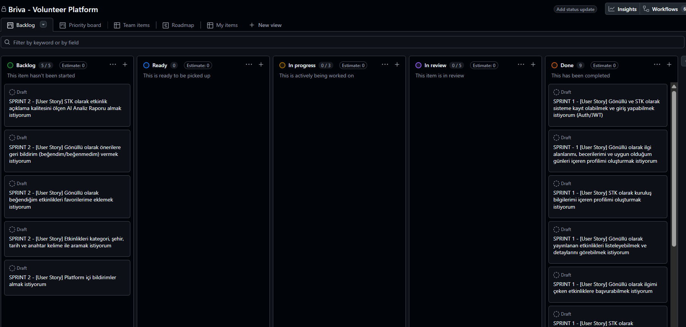
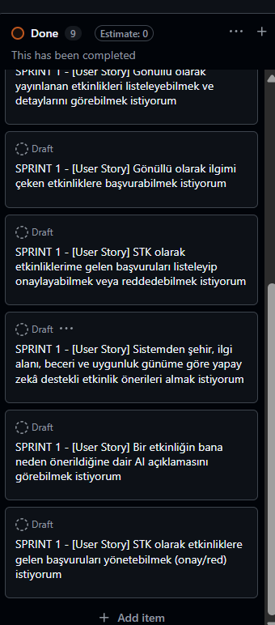

# **Takım İsmi**

Takım 122

# Ürün İle İlgili Bilgiler

## Takım Elemanları

- Şüheda Nur Gül: Product Owner / Developer
- Mesut Baksı: Scrum Master
- Tarık Sarısı: Team Member

> **Not:** Proje geliştirme süreci, Product Owner tarafından tek başına yürütülmektedir.

## Ürün İsmi

🌉 **Briva** – Yapay Zekâ Destekli Gönüllülük Platformu

### İsim Kökeni

Briva ismi iki kavramdan türetilmiştir:

- **Bridge (Köprü)** → Gönüllüler ve STK'lar arasında bağlantı kurma  
- **Viva (Yaşam)** → İyiliğin ve sosyal etkinin hayatın içinde olması  

> İnsanları ve iyiliği birbirine bağlayan dijital köprü

## Ürün Açıklaması

Briva, gönüllüler ile sivil toplum kuruluşlarını tek bir platformda buluşturan yapay zekâ destekli bir gönüllülük sistemidir. Amaç, gönüllülüğü daha erişilebilir hale getirerek **doğru insanı doğru sosyal etki fırsatıyla buluşturmaktır.**

Bu proje **YZTA 2026 Yapay Zekâ ve Teknoloji Atölyesi Bootcamp Hackathon'u** için geliştirilmiştir.

### 🎯 Problem

Gönüllülük süreçleri şu anda parçalı ve verimsiz şekilde ilerlemektedir:

| Problem | Açıklama |
|--------|----------|
| Dağınıklık | Etkinlikler farklı kanallarda (sosyal medya vb.) |
| Eşleşme Sorunu | Gönüllüler uygun etkinliği bulamıyor |
| STK Erişim Sorunu | STK'lar doğru gönüllülere ulaşamıyor |
| Kişiselleştirme Eksikliği | Kullanıcıya özel öneri sistemi yok |

### 💡 Çözüm

Briva, tüm gönüllülük süreçlerini tek platformda toplar ve kullanıcıya özel öneriler sunar.

| Bileşen | Görev |
|--------|------|
| Gönüllü Profili | İlgi alanları, beceriler, uygunluk |
| STK Paneli | Etkinlik oluşturma ve başvuru yönetimi |
| AI Katmanı | Kural tabanlı eşleştirme ve öneri sistemi |

## Ürün Özellikleri

| Modül | Açıklama |
|------|----------|
| Gönüllü Profili | İlgi alanı, beceri, konum ve uygunluk bilgileri |
| STK Sistemi | Etkinlik oluşturma ve gönüllü yönetimi |
| AI Öneri Sistemi | Kural tabanlı kişiselleştirilmiş etkinlik önerileri |
| Etkinlik Başvuru Sistemi | Gönüllülerin etkinliklere katılımı |
| AI Etkinlik Analizörü | Etkinlik açıklaması kalite analizi (Sprint 2) |
| Favori Sistemi | Etkinlik kaydetme (Sprint 2) |
| Rozet Sistemi | Gamification ile motivasyon (Sprint 3) |
| Dashboard | Gönüllü ve STK istatistikleri (Sprint 3) |

## Hedef Kitle

| Grup | Açıklama |
|------|----------|
| Gönüllüler | Sosyal sorumluluk projelerine katılmak isteyen bireyler |
| STK'lar | Gönüllü ihtiyacı olan sivil toplum kuruluşları |
| Üniversite Öğrencileri | Sosyal etki ve deneyim kazanmak isteyen gençler |
| Kurumsal Yapılar | CSR (sosyal sorumluluk) projeleri yürüten şirketler |

## Product Backlog URL

Backlog bu README içinde yönetilmektedir.

## 🏗️ Sistem Mimarisi

Briva, modüler ve servis tabanlı bir mimari ile tasarlanmıştır. MVP aşamasında sadelik ve çalışan özellikler ön plandadır.

| Katman | Teknoloji | Açıklama |
|--------|-----------|----------|
| Backend | Python + Flask | REST API tabanlı ana sistem |
| Veritabanı | SQLite (→ PostgreSQL planlanıyor) | Kullanıcı ve etkinlik verisi |
| ORM | SQLAlchemy | Veritabanı modelleme ve sorgulama |
| AI Katmanı | Python (kural tabanlı) | Deterministik öneri motoru |
| Kimlik Doğrulama | JWT (Flask-JWT-Extended) | Token tabanlı oturum yönetimi |
| Güvenlik | Flask-Talisman, Flask-Limiter | Security headers ve rate limiting |
| API Standardı | REST + JSON | Tüm endpoint'ler `/api/` altında |

## 🔌 Backend API Endpoint'leri

### 👤 Auth Servisi
| Endpoint | Metod | Açıklama |
|----------|-------|----------|
| /api/auth/register | POST | Kullanıcı kayıt (email + password + role) |
| /api/auth/login | POST | Kullanıcı giriş |
| /api/auth/me | GET | Mevcut kullanıcı bilgisi (JWT gerekli) |

### 🙋 Gönüllü Servisi
| Endpoint | Metod | Açıklama |
|----------|-------|----------|
| /api/volunteers/me | GET | Kendi profilini görüntüle |
| /api/volunteers/me | PUT | Profil oluştur / güncelle |
| /api/volunteers/{id} | GET | Gönüllü profili getir |

### 🏢 STK Servisi
| Endpoint | Metod | Açıklama |
|----------|-------|----------|
| /api/organizations | POST | STK profili oluştur |
| /api/organizations | GET | STK'ları listele (şehir/doğrulama filtreli) |
| /api/organizations/{id} | GET | STK detayı (etkinlikleriyle birlikte) |
| /api/organizations/{id} | PUT | STK profili güncelle |

### 🎯 Etkinlik Servisi
| Endpoint | Metod | Açıklama |
|----------|-------|----------|
| /api/events | POST | Yeni etkinlik oluştur (STK) |
| /api/events | GET | Etkinlikleri listele (şehir/kategori/durum filtreli, sayfalı) |
| /api/events/{id} | GET | Etkinlik detayı |
| /api/events/{id} | PUT | Etkinlik güncelle (STK) |
| /api/events/{id}/apply | POST | Etkinliğe başvur (Gönüllü) |
| /api/events/{id}/applications | GET | Etkinlik başvurularını listele (STK) |

### 📋 Başvuru Servisi
| Endpoint | Metod | Açıklama |
|----------|-------|----------|
| /api/applications/my | GET | Kendi başvurularımı listele |
| /api/applications/{id} | PUT | Başvuru durumu güncelle (onay/red/iptal) |

### 🧠 AI Öneri Servisi
| Endpoint | Metod | Açıklama |
|----------|-------|----------|
| /api/recommendations | POST | Serbest kullanıcı bağlamıyla öneri al |
| /api/recommendations/me | GET | Profil tabanlı kişisel öneriler (JWT gerekli) |
| /api/recommendations/explain | POST | Belirli bir etkinlik için öneri açıklaması |

# Sprint 1 — Core Platform ✅

**Sprint Hedefi:** Çalışan uçtan uca MVP'yi oluşturmak. Kullanıcılar kayıt olup giriş yapabilmeli, STK'lar etkinlik oluşturabilmeli, gönüllüler etkinliklere başvurabilmeli ve kişiselleştirilmiş öneriler alabilmeli.

**Sprint Notları:** Backlog'umuz ilk yapılacak story'lere göre düzenlenmiştir. Sprint başına tahmin edilen puan sayısını geçmeyecek şekilde sıradan seçimler yapılmaktadır. Story başına çıkan tahmin puanı, toplam puanın yarısından az tutulmuştur.

**Puan tamamlama mantığı:** Sprint içinde tamamlanması tahmin edilen toplam puan 100'dür. Tüm hikayeler tamamlanmıştır.

- **Sprint 1 içinde tamamlanması tahmin edilen puan:** 100
- **Tamamlanan puan:** 100
- **Daily Scrum:** Proje tek geliştirici tarafından yürütüldüğü için günlük stand-up toplantısı yapılmamıştır. Bunun yerine geliştirme süreci kişisel planlama notları ile takip edilmiştir.

**Geliştirici ilerleme notları:**

> **Gün 1-2:** Proje yapısı oluşturuldu. Flask uygulaması init edildi. SQLite ve SQLAlchemy yapılandırıldı. User modeli ve auth route'ları (register/login/me) JWT ile birlikte tamamlandı.
>
> **Gün 3-4:** Volunteer ve Organization modelleri ve CRUD route'ları yazıldı. Validasyon katmanı (validators.py) ve yetkilendirme yardımcıları (auth_helpers.py) oluşturuldu.
>
> **Gün 5-6:** Event modeli ve tam CRUD route'ları tamamlandı. Şehir/kategori/durum filtreleme ve pagination eklendi. Etkinliğe başvuru sistemi kapasit kontrolü ve mükerrer başvuru kontrolü ile yazıldı. Application yönetimi route'ları (approve/reject/cancel) tamamlandı.
>
> **Gün 7-8:** RecommendationEngine sınıfı tasarlandı ve geliştirildi. Şehir (+40), ilgi alanı (+30), beceri (+20), uygunluk günü (+10) bazında skorlama sistemi oluşturuldu. Recommendations API endpoint'leri (öneri, profil tabanlı öneri, açıklama) yazıldı.
>
> **Gün 9-10:** Error handler'lar, Talisman güvenlik header'ları ve rate limiting eklendi. Seed data hazırlandı. Tüm endpoint'ler entegrasyon testi geçirildi. Sprint boyunca planlanan kapsam tamamlandı; geliştirme sürecinde temel güvenlik ve API standartları da MVP'nin parçası olarak erken aşamada sisteme entegre edildi.

**Sprint board screenshotları:**

Sprint board ekran görüntüleri `ProjectManagement/Sprint1Documents/` klasöründe yer almaktadır:

*   
*   

**Ürün Durumu (Swagger UI API Dokümantasyonu ve Testleri):**

Sprint 1 sonunda çalışan backend API ve Swagger UI mevcuttur. Ekran görüntüleri `ProjectManagement/Sprint1Documents/` klasöründe yer almaktadır:

*   
*   .png)

**Sprint Review:**

- Sprint 1'de planlanan 100 puanın tamamı başarıyla tamamlanmıştır.
- Kullanıcı kayıt/giriş ve JWT kimlik doğrulama sistemi çalışmaktadır.
- Gönüllü ve STK profil yönetimi (oluşturma/güncelleme) tamamlanmıştır.
- STK'lar etkinlik oluşturabilir, güncelleyebilir; gönüllüler etkinliklere başvurabilir.
- Başvuru yönetim sistemi (onay/red/iptal) rol bazlı yetkilendirme ile çalışmaktadır.
- Kural tabanlı AI öneri motoru tamamlanmıştır — şehir, ilgi alanı, beceri ve uygunluk günü bazında kişiselleştirilmiş eşleştirme yapılmaktadır.
- Explain API ile kullanıcıya "neden bu etkinlik önerildi?" açıklaması sunulmaktadır.
- Filtreleme, sayfalama ve validasyon katmanları eklenmiştir.
- Güvenlik önlemleri (Talisman, rate limiting, CORS) MVP'nin parçası olarak erken aşamada entegre edilmiştir.

**Sprint Retrospective:**

- **İyi giden:** Modüler mimari sayesinde her bileşen bağımsız şekilde geliştirilebildi. Öneri motoru deterministik ve açıklanabilir şekilde tasarlandı; Türkçe karakter desteği baştan sağlandı. Validasyon ve error handling baştan sona tutarlı tutuldu. Temel güvenlik ve API standartları MVP'nin parçası olarak erken aşamada sisteme entegre edildi.
- **Geliştirilebilecek:** Tek geliştirici olarak çalışıldığı için code review süreci uygulanamadı. Test coverage eksik — birim testler yazılmadı. Sprint kapsamı geniş tutuldu; bazı görevler (güvenlik header'ları, rate limiting) ayrı bir teknik borç sprint'inde ele alınabilirdi.
- **Aksiyon:** Sonraki sprintlerde AI kalitesi ve kullanıcı deneyimi iyileştirmelerine odaklanılacak.

---

# Sprint 2 — Smart Platform (Gelecek Aşama)

*Bu sprint sonraki geliştirme dönemleri için planlanmıştır. Detaylar ve kapsam gizli tutulmaktadır.*

---

# Sprint 3 — Engagement & Analytics (Gelecek Aşama)

*Bu sprint sonraki geliştirme dönemleri için planlanmıştır. Detaylar ve kapsam gizli tutulmaktadır.*

---

## 🚀 MVP Kapsamı

Briva'nın mevcut durumunda:

- ✅ Kullanıcı kayıt ve giriş sistemi (JWT)
- ✅ Gönüllü ve STK profil yönetimi
- ✅ Etkinlik CRUD (oluşturma, listeleme, güncelleme)
- ✅ Etkinlik filtreleme ve sayfalama
- ✅ Etkinlik başvuru sistemi
- ✅ Başvuru yönetimi (onay/red/iptal)
- ✅ Kural tabanlı AI öneri motoru
- ✅ Öneri açıklama API'si
- ✅ Güvenlik katmanları (JWT, Talisman, Rate Limiting, CORS)

## 🗺️ Future Work / Yol Haritası

| Özellik | Açıklama | Öncelik |
|---------|----------|---------|
| PostgreSQL Migration | SQLite → PostgreSQL geçişi (prod ortamı) | Yüksek |
| React Frontend | Kullanıcı arayüzü geliştirme | Yüksek |
| Docker | Container tabanlı deployment | Orta |
| Unit Tests | Kapsamlı birim test suite | Orta |
| CI/CD | GitHub Actions ile otomatik test ve deploy | Orta |
| Email Notifications | Gerçek e-posta bildirim sistemi | Düşük |
| FastAPI Migration | Flask → FastAPI geçişi (performans) | Düşük |

## 🎯 Ürün Vizyonu

Briva sadece bir etkinlik platformu değildir.

- Gönüllülüğü erişilebilir hale getirir  
- Doğru eşleşmeleri sağlar  
- Sosyal etkiyi artırır  
- Gönüllülüğü bir "yaşam yolculuğuna" dönüştürür  
